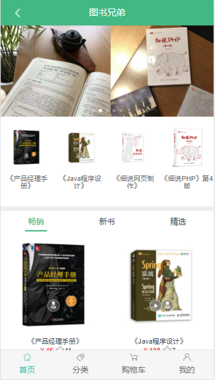
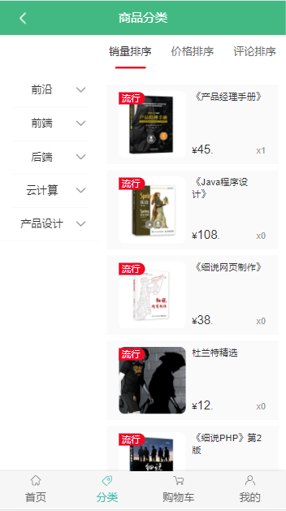
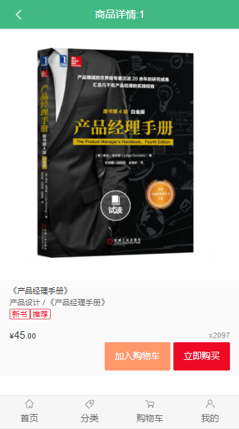
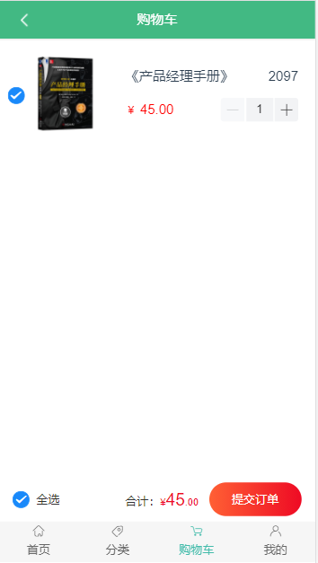
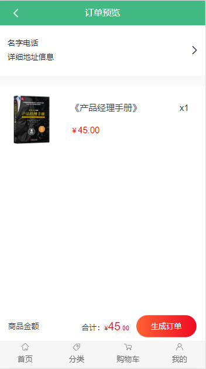

# EWShop

## 项目介绍

EWShop是一款移动版图书商城项目，包含首页门户、商品详情、商品分类、购物车、订单提交、个人中心等模块。（个人练习项目，不可做商业用途）

## 所用技术

* Vue3
* Vue CLI, Vue Router, Vuex
* Vant
* Axios

### 项目线上预览地址

https://www.daoxiaoyao.ltd/dist/index.html#/

### 页面展示











### 相关资料

视频资料：[【vue3.x】2021最新版Vue全套课程#Web框架学习基础+Vue全家桶+Vue实战项目（已完结）_哔哩哔哩 (゜-゜)つロ 干杯~-bilibili](https://www.bilibili.com/video/BV1Pz4y1S7Uv?p=1)

Vue官网：[Vue.js (vuejs.org)](https://v3.cn.vuejs.org/)

后端接口文档：https://www.showdoc.com.cn/1207745568269674?page_id=6090123481636428

## Project setup

```
npm install
```

### Compiles and hot-reloads for development
```
npm run serve
```

### Compiles and minifies for production
```
npm run build
```

### Customize configuration
See [Configuration Reference](https://cli.vuejs.org/config/).
